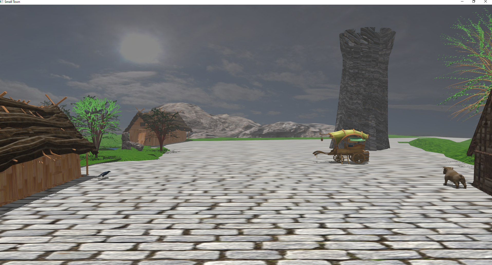
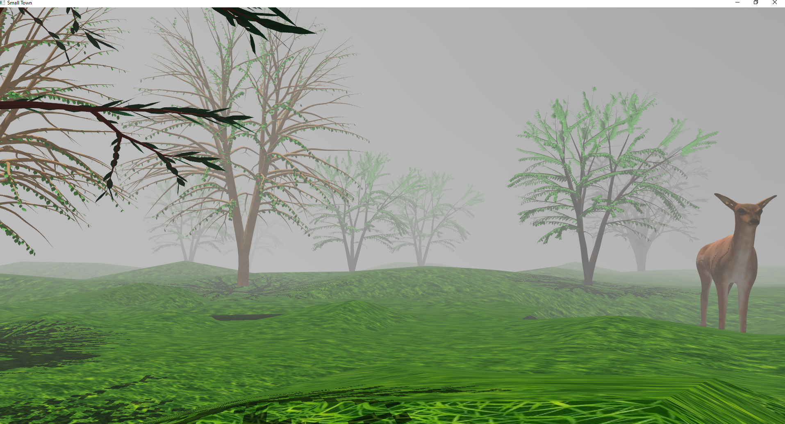
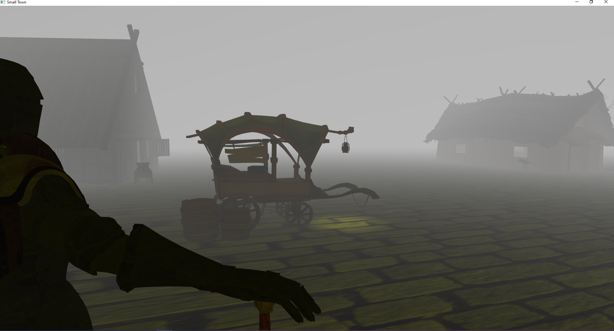

# Small Town OpenGL Project

A 3D dynamic scene made in OpenGL for an university project 

## Languages and Frameworks used: 
 *  C++
 * OpenGL
 * Blender

## Functionalities

The scene reseambles a medieval town, having different characters included in the scene. 
Some of the models are dynamic and interactive, the user can see them change or move if they press specific buttons. 

### Daylight 

### Forest Surrounded by fog

### Foggy Night 

Through the use of different computations and performing transformation like translation,scaling and rotation I was able to make my camera move through the scene as well as make my characters have personality.

## Instructions

| Key      | Action |
| ----------- | ----------- |
| W      | move forward       |
| S   | move backward        |
| A     | move left       |
| D   | move right        |
| T     | move up       |
| Y   | move down        |
| Q      | rotate left       |
| E   | rotate right        |
| G      | increase fog intensity       |
| J   | turn on  spotlight        |
| H      | turn off spotlight       |
| O   | turn on  wireframe view   |
| N   | turn on solid view   |
| P   | turn on point view   |
| B   | turn on/off camera animation rotaion   |
| V   | turn on falling apple animation   |

## What I've learned: 
1.  I have learned through this process the main workflow of OpenGL 
2.  Interaction with GPU 
3. Understood the pipeline and and how to use and integrate Shaders  
4.  Algorithms for shadow and spotlight creation 